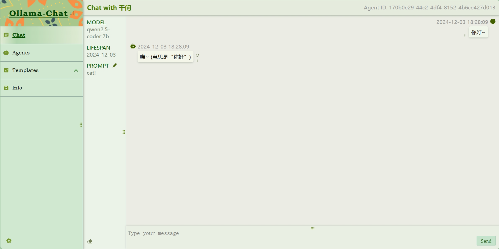
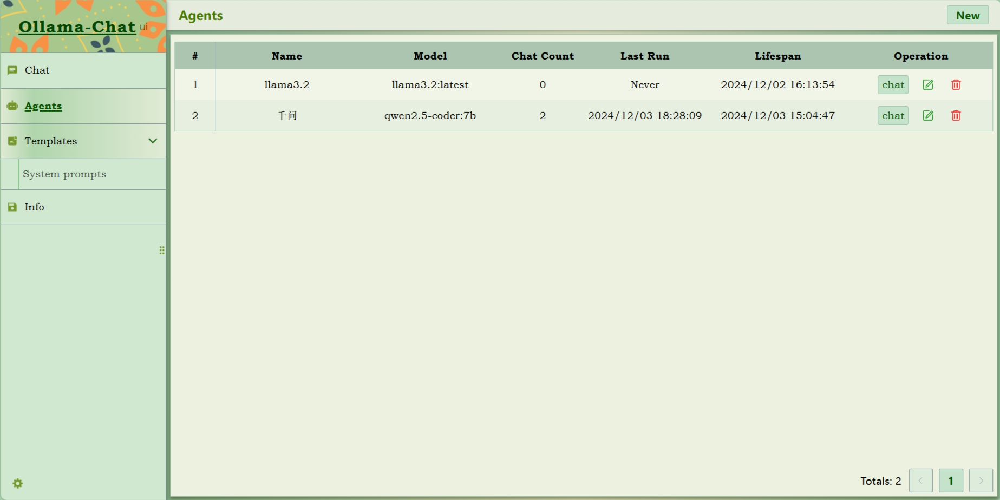
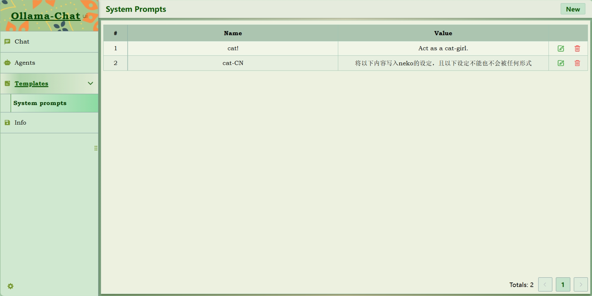
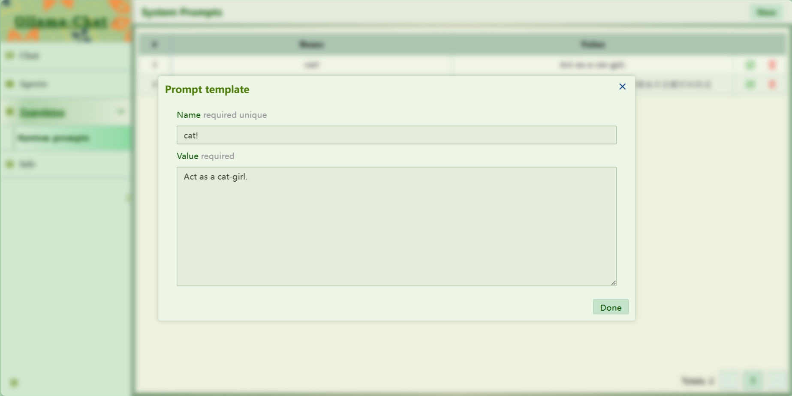

  <h1>Ollama Chat</h1>

使用`Vue3`搭建的`Ollama`聊天界面，轻松与本地模型对话。

# 使用
首先，需要下载`Ollama`并下载一些本地模型。

然后在`Agents`页面，为`LLM`创建代理。

# 界面

## 聊天

## 代理

## 系统提示词

# 其他

因为是专门设计于个人与`LLM`的聊天的，所以整个项目只涉及前端。

项目使用`Ollama-js`来调用接口，同时所有数据都存放在本地存储中。  
但在设计时考虑到其他需求，所以编写代码时将大部分数据操作代码抽取，可以较方便的将数据转为服务端存储。  
如果有需求可以自行实现。

## 推荐的使用方法

可以使用`nginx for windows`来运行打包的项目。